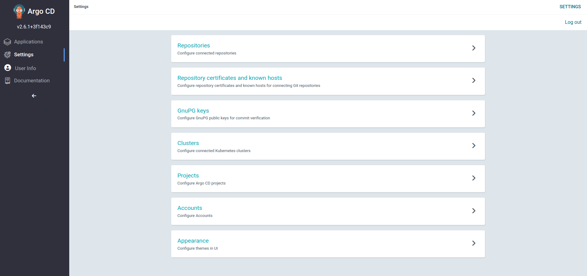
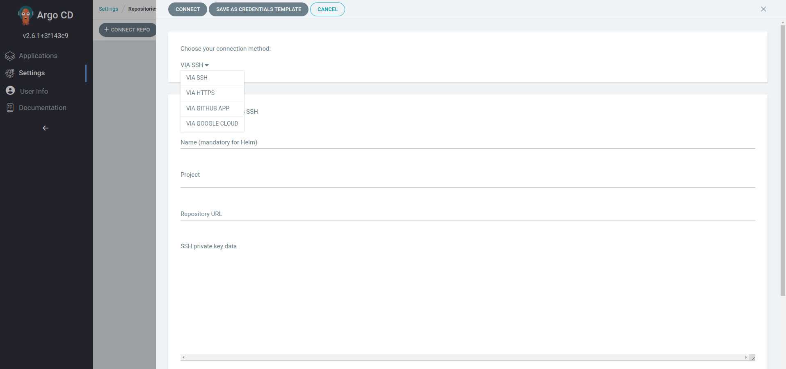

# Introduccion

Esta carpeta contiene manifiestos que deben ser aplicados sobre el cluster de
kubernetes para que el flujo propuesto funcione.

## Configurando nuesto ambiente local para utilizar secretos.

Prerequisitos:
- [sops](https://github.com/mozilla/sops)
- [age](https://github.com/FiloSottile/age)

> es deseable tambien utilizar [direnv](https://direnv.net/)

En el archivo [envrc](../.envrc) tenemos definida la clave publica de age
(`SOPS_AGE_KEY_RECIPIENTS`). Tambien se define el lugar donde podemos encontrar
la clave privada asociada a la clave publica (`SOPS_AGE_KEY_FILE`). Entonces
basta con crear el archivo `.age/key.txt` en la raiz del proyecto.

Teniendo el archivo con la clave privada y la variable de ambiente con la clave
publica, ya podemos encriptar y desencriptar **todos** los archivos de este
repositorio.

## Repositorios

### Repositorio del flujo de gitops

Dado que este es un repositorio privado debemos configurar argocd para que pueda
acceder al mismo para leer los valores de configuracion junto con el chart que
da origen al flujo.

Tenemos dos formas de agregarlo

### Metodo 1 - Utilizando la ui de argo

Una vez que ingresamos en argo vamos al apartado `settings`. Alli veremos
distintas configuraciones de argo. La que nos interesa es `Repositories`


Al ingresar a `repositories` ingresamos a `+ connect repo` y nos desplegara un
menu para conectar un repositorio con argocd



Alli seleccionamos como metodo de conexion `https` y tipo `git`. Lo nombramos, 
le damos un proyecto (basta con ponerlo en el default ya que los proyectos que
creemos utilizaran los repositorios globales. Aunque vale mencionar que los
repositorios pueden ser aplicados **por proyecto**)

Configuramos la url, para el caso 
`https://github.com/Mikroways/tq-gitops-workflow`, el usuario y la password.
Para guardarlo utilizamos el boton `connect`. 

Hecho esto, si todo esta bien veremos el repositorio con connection status
`succesfull`, lo que significa que argo puede llegar al mismo.


### Metodo 2 - Creando un repositorio via kubectl.

Los repositorios se guardan en la instalacion de argocd como secretos con el
label: `argocd.argoproj.io/secret-type: repository`.

Entonces basta crear estos secretos en el namespace de argo para que
automaticamente los tome. Se provee el manifiesto para su aplicacion.

Como contiene datos sensibles se suben encriptados con
[sops](https://github.com/mozilla/sops) y
[age](https://github.com/FiloSottile/age). Por
lo tanto su aplicacion no es tan directa como con el appset.

Primero debemos configurar nuestro ambiente para utilizar sops/age. [ver
siguiente seccion](#configurando-nuestro-ambiente-local-para-utilizar-secretos).

Con nuestro ambiente configurado, desencriptamos el manifiesto y lo aplicamos en
el cluster.

```sh
sops -d gitops-repo-secret.enc.yaml | kubectl apply -f - --namespace argocd
```
> Se utiliza como namespace `argocd` que es el usual para las instalaciones de
> argocd. Reemplazar por el valor correcto segun corresponda.

## Application set

Este CR define un [Application set de
argocd](https://argo-cd.readthedocs.io/en/stable/user-guide/application-set/).
Nos sirve para permitir el despliegue de aplicaciones de forma desatendida por
usuarios (usualmente desarrolladores) sin la necesidad de contar con privilegios
de administrador en el cluster, siquiera en argocd.

El mismo debe ser responsabilidad de los administradores del cluster.

Para aplicarlo basta con ejecutar

```sh
kubectl apply -f appset.yaml --namespace argocd
```
> Se utiliza como namespace `argocd` que es el usual para las instalaciones de
> argocd. Reemplazar por el valor correcto segun corresponda.
> Tener en cuenta que, tal cual esta definido este appset, al aplicarlo se
> desplegaran automaticamente todas las aplicaciones definidas en
> [projects](projects)
